# Lab-3-Inverse-Dynamics-Control 

## Introducción

El control por movimiento de los manipuladores móviles requieren considerar fuerzas externas al sistema, así como la provocada por la gravedad, inercia, Coriolis, etc. Si no se tienen en cuenta estos efectos, el seguimiento de trayectorias del robot puede provocar errores significativos. En esta práctica se estudiará una técnica para compensar estas dinámicas no lineales del manipulador, el control por dinámica inversa (Inverse Dynamics Control), el cual, nos permitirá linealizar  el sistema, facilitando el diseño de controladores. El informe queda dividido principalmente en dos puntos: la compensación de gravedad y la cancelación dinámica completa (donde, además de la fuerza de la gravedad, se compensan los efectos no lineales como la inercia, Coriolis y fricción).

---

## Tarea 1: Compensación de la Gravedad

En este ejercicio se solicita la implementación de un sistema que compense la fuerza de la gravedad, permitiendo que el manipulador se mantenga en la posición requerida sin "caerse" por la aceleración que esta provoca. Si se le aplica cualquier otra fuerza externa, el control no la compensaría (Para ello se realizarán posteriores estudios).

### Fundamentos teóricos

Tal y como se ha explicado previamente, el torque demandado es igual al producido por la fuerza de la gravedad:

$$
M(q)\ddot{q} + C(q,\dot{q})\dot{q} + F_b\dot{q} + g(q) = \tau
$$

Donde:

- $M(q)$ es la matriz de inercia.
- $C(q,\dot{q})\dot{q}$ son los efectos de las fuerzas de Coriolis y centrífugas.
- $F_b\dot{q}$ representa la fuerza viscosa.
- $g(q)$ es el vector gravedad (objetivo a cancelar en este caso).
- $\tau$ es el vector par comandado al manipulador.

Para cancelar la fuerza de gravedad, $\tau$ y $g(q)$ deben ser idénticos:

$$
\tau = g(q)
$$

Por ello, se crea un nodo ROS2 llamado `gravity_compensation.cpp` (con su correspondiente `gravity_compensation_launch.py` y modificación del `CMakeLists.txt`). Su método encargado del cálculo es el siguiente:

```cpp
// Method to calculate the desired joint torques
Eigen::VectorXd gravity_compensation()
{
    // Placeholder for calculate the commanded torques
    // Calculate the control torque to compensate only for gravity effects: tau = g(q)

    // Calculate g_vect

    // Initialize q1, q2, q_dot1, and q_dot2
    double q1 = joint_positions_(0);
    double q2 = joint_positions_(1);
    Eigen::VectorXd g_vec(2);

    g_vec << (m1_ + m2_) * l1_ * g_ * cos(q1) + m2_ * g_ * l2_ * cos(q1 + q2),
        m2_ * g_ * l2_ * cos(q1 + q2);

    // // Calculate desired torque
    Eigen::VectorXd torque(2);
    torque << g_vec;

    return torque;
}
```

En él, se han tomado las dos variables articulares, $q1$ y $q2$ para construir con ellas el torque necesario según la siguiente fórmula:

$$
g(q)=
\begin{bmatrix}
(m_1+m_2)l_1g\cos(q_1)+m_2l_2g\cos(q_1+q_2) \\
m_2l_2g\cos(q_1+q_2)
\end{bmatrix}
$$

---

### Resultados

Al enviar (45º, 45º) como consigna de las variables articulares se obtiene el siguiente comportamiento del manipulador:

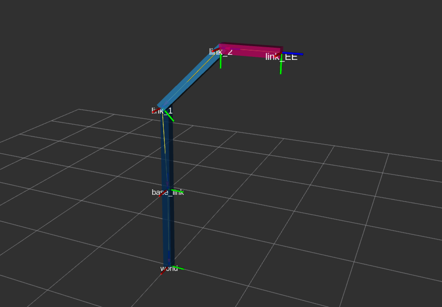

Por otra parte, se comprueba con el comando `python3 wrench_trackbar_publisher.py` que, al someter el efector final a otras fuerzas externas, el robot es empujado en el sentido de la misma, ignorando su propio peso, por lo que no cae.


Siendo su conexión de nodos:

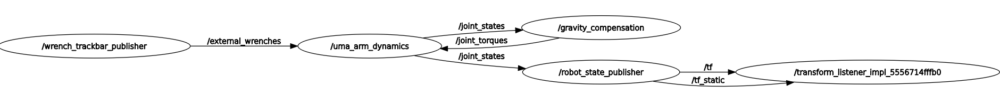

---

## Tarea 2: Cancelación Dinámica Completa

El objetivo en esta segunda tarea trata de compensar las dinámicas no lineales del manipulador, así como la fuerza centrífuga, Coriolis y fricción. A continuación se detallan los pasos para ello.

### Fundamentos teóricos

Inicialmente, se parte de la anterior ecuación de la dinámica del manipulador:

$$
M(q)\ddot{q} + C(q,\dot{q})\dot{q} + F_b\dot{q} + g(q) = \tau
$$

Donde se busca cancelar toda la dinámica no lineal, por lo que será necesario un par tal que:

$$
\tau = M(q)\ddot{q}_d + C(q,\dot{q})\dot{q} + F_b\dot{q} + g(q) = M(q)\ddot{q}_d + n(q,\dot{q})
$$

Al sustituir esta ley de control en la dinámica, resulta:

$$
M(q)\ddot{q} = M(q)\ddot{q}_d
$$

Y al ser invertible la matriz de inercia:

$$
\ddot{q} = \ddot{q}_d
$$

Si se realiza la transformada de Laplace, se obtiene la función de transferencia:

$$
\frac{Q(s)}{\ddot Q_d(s)} = \frac{1}{s^2}
$$

Se observa que para pasar de aceleración angular a posición, el sistema necesita dos integradores, siendo la planta marginalmente estable. Su esquema de control el siguiente:

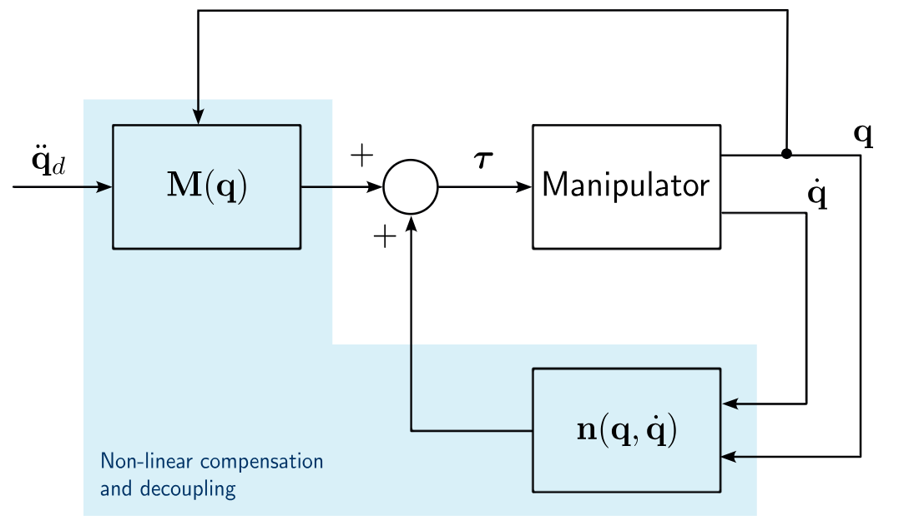

Para implementarlo se crea el nodo `dynamics_cancellation.cpp` a partir del anterior, modificando el método `cancel_dynamics()` con la dinámica proporcionada en el nodo `uma_arm_dynamics.cpp` y el cálculo del torque explicado anteriormente:

```cpp

// Method to calculate joint acceleration
Eigen::VectorXd cancel_dynamics()
{
    // Initialize M, C, Fb, g_vec, and tau_ext
    Eigen::MatrixXd M(2, 2);
    Eigen::VectorXd C(2);
    Eigen::MatrixXd Fb(2, 2);
    Eigen::VectorXd g_vec(2);
    Eigen::MatrixXd J(2, 2);
    Eigen::VectorXd tau_ext(2);

    // Initialize q1, q2, q_dot1, and q_dot2
    double q1 = joint_positions_(0);
    double q2 = joint_positions_(1);
    double q_dot1 = joint_velocities_(0);
    double q_dot2 = joint_velocities_(1);

    // Calculate matrix M
    M(0, 0) = m1_ * pow(l1_, 2) + m2_ * (pow(l1_, 2) + 2 * l1_ * l2_ * cos(q2) + pow(l2_, 2));
    M(0, 1) = m2_ * (l1_ * l2_ * cos(q2) + pow(l2_, 2));
    M(1, 0) = M(0, 1);
    M(1, 1) = m2_ * pow(l2_, 2);

    // Calculate vector C (C is 2x1 because it already includes q_dot)
    C << -m2_ * l1_ * l2_ * sin(q2) * (2 * q_dot1 * q_dot2 + pow(q_dot2, 2)),
    m2_ * l1_ * l2_ * pow(q_dot1, 2) * sin(q2);

    // Calculate Fb matrix
    Fb << b1_, 0.0,
    0.0, b2_;

    // Calculate g_vec
    g_vec << (m1_ + m2_) * l1_ * g_ * cos(q1) + m2_ * g_ * l2_ * cos(q1 + q2),
        m2_ * g_ * l2_ * cos(q1 + q2);

    // Calculate control torque using the dynamic model: torque = M * q_ddot + C * q_dot + Fb * q_dot + g
    Eigen::VectorXd torque(2);
    Eigen::VectorXd q_dot(2);
    q_dot << q_dot1, q_dot2;

    torque << M * desired_joint_accelerations_ + C + Fb * q_dot + g_vec;

    return torque;
}

```

Posteriormente, se crea su correspondiente `dynamics_cancellation_launch.py` y se añade en el `CMakeLists.txt`.

---

### Resultados

Se le envía al manipulador la trayectoria pedida en el guion y resulta el siguiente movimiento:

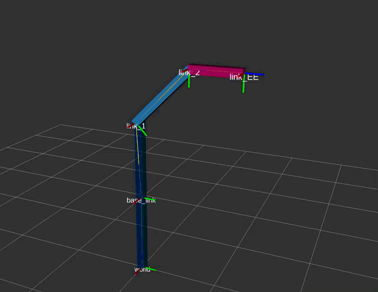

Siendo sus gráficas de posición, aceleración y velocidad las esperadas:

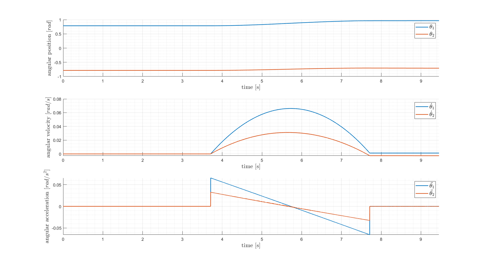

Adicionalmente, esta es la conexión de topics: 

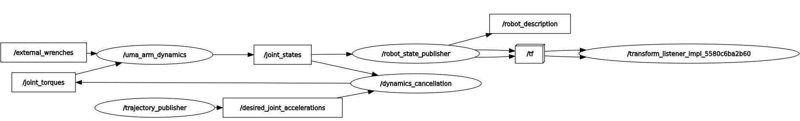

---

## Tarea 3: Experimentos

En primer lugar, se propone el estudio de los dos controladores anteriores para valores erróneos de los parámetros dinámicos del manipulador, los reales son:

```cpp

uma_arm_dynamics:
  ros__parameters:
    frequency: 1000.0
    m1: 3.0
    m2: 2.0
    l1: 1.0
    l2: 0.6
    b1: 5.0
    b2: 5.0
    g: 9.81
    q0: [0.785398, -0.785398]

```

### Compensación de la Gravedad

Se modifican los valores de $m1$, $m2$, $l1$ y $l2$:

```cpp

gravity_compensation:
  ros__parameters:
    frequency: 1000.0
    m1: 5.0
    m2: 5.0
    l1: 5.0
    l2: 5.0
    b1: 5.0
    b2: 5.0
    g: 9.81
    q0: [0.785398, -0.785398]

```

El resultado es un manipulador que no se queda inmóvil en la posición deseada, el par enviado depende de estos parámetros érroneos: Al haber aumentado el valor de todos ellos, el resultado es un mayor torque, haciendo que el manipulador intente elevarse más de lo que necesita para compensar el efecto de la gravedad. Esta dependencia del par respecto a estos parámetros se podía predecir observando el anterior fragmento de código: 

```cpp

g_vec << (m1_ + m2_) * l1_ * g_ * cos(q1) + m2_ * g_ * l2_ * cos(q1 + q2),
    m2_ * g_ * l2_ * cos(q1 + q2);

```


---

### Cancelación Dinámica Completa

En este experimento se modificarán los parámetros de la siguiente forma:

```cpp

dynamics_cancellation:
  ros__parameters:
    frequency: 1000.0
    m1: 4.0
    m2: 1.0
    l1: 1.5
    l2: 1.0
    b1: 5.0
    b2: 5.0
    g: 9.81
    q0: [0.785398, -0.785398]

```

En esta ocasión, se ha optado por modificar aleatoriamente todos ellos, provocando incluso inestabilidad en esta ocasión:


La explicación es análoga a la anterior, el torque depende de todos los parámetros modificados.

---

### Cancelación Dinámica Completa: Aplicación de Fuerzas

Anteriormente se ha estudiado la respuesta del control de cancelación de gravedad frente a fuerzas externas, no obstante, es significativo remarcar la respuesta del sistema con el controlador de cancelación de dinámica completa ante perturbaciones similares. Se realiza el experimento y se observa:

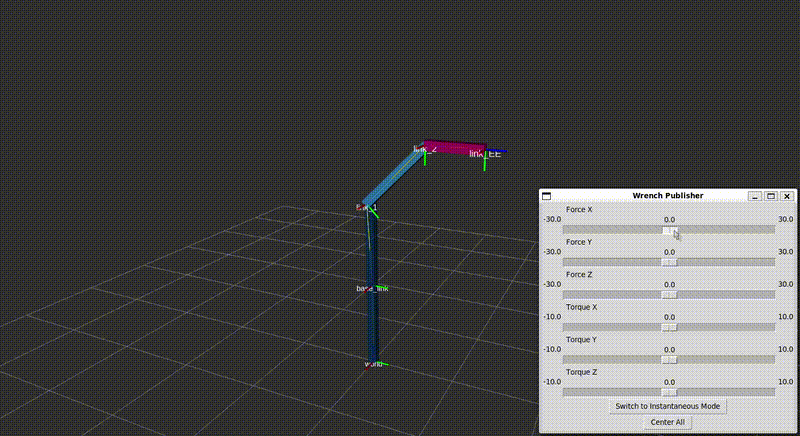

El resultado es un sistema inestable, ya que, según se expresó anteriormente El bucle cuenta con dos integradores, haciéndolo críticamente inestable. Cualquier perturbación externa provocará la inestabilidad en el sistema.

## Tarea 4: Cancelación Dinámica Completa + PD

En vistas a garantizar la estabilidad del sistema, se añade un control PD, provocando que los integradores en bucle cerrado se transformen en polos negativos, logrando la estabilidad. 

---

### Fundamentos teóricos

En el punto anterior se obtuvo:

$$
\ddot q = \ddot q_d
$$

Mientras que el controlador PD genera la aceleración deseada:

$$
\ddot q_d = K_p(q_d-q)+K_d(\dot q_d-\dot q)
$$

Al sustituir se obtiene:

$$
\ddot q = K_p(q_d-q)+K_d(\dot q_d-\dot q)
$$

Y al aplicar la transformada:

$$
\frac{Q(s)}{Q_d(s)} = \frac{K_d s + K_p} {s^2 + K_d s + K_p}
$$

Observándose plenamente esos dos polos negativos espuestos con anterioridad. El bucle de control resultante es:

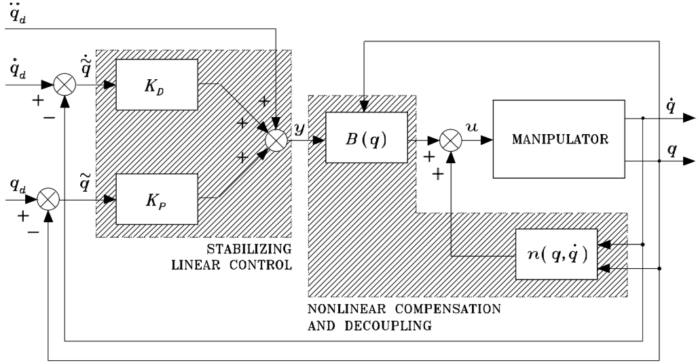

Por ello, es necesaria la siguiente relación nodos-topics:

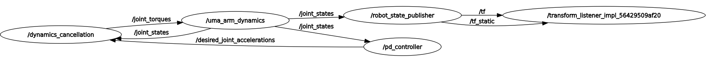

Las principales modificaciones son las siguientes:

- Suscripción al topic `/joint_states` para recibir el estado articular actual.
- Publicación al topic `/desired_joint_accelerations` para publicar la aceleración deseada calculada.

Análogo a los anteriores, se crea un nuevo nodo, `PD_controller.cpp`, con sus suscripciones correspondientes:

```cpp

// Create subscription to joint_torques
subscription_joint_states_ = this->create_subscription<sensor_msgs::msg::JointState>(
    "joint_states", 1, std::bind(&PDControllerNode::joint_states_callback, this, std::placeholders::_1));

// Create publishers for joint torque
publisher_topic_send_accelerations = this->create_publisher<std_msgs::msg::Float64MultiArray>("desired_joint_accelerations", 1);

// Set the timer callback at a period (in milliseconds, multiply it by 1000)
timer_ = this->create_wall_timer(
    std::chrono::milliseconds(static_cast<int>(1000 / frequency)), std::bind(&PDControllerNode::timer_callback, this));

```

En esta ocasión, las aceleraciones enviadas deberán ser las calculadas en el método `PD_control()`:

```cpp

    // Timer callback - when there is a timer callback, computes the new joint acceleration, velocity and position and publishes them
    void timer_callback()
    {
        // Calculate desired acceleration to cancel the dynamic effects
        topic_send_accelerations = PD_control();

        // Publish data
        publish_data();
    }

```

En este método se implementa el cálculo del controlador:

```cpp

// Method to calculate joint acceleration
Eigen::VectorXd PD_control()
{
    // Declarar posición deseada: 0.785, -0.785 1.0, 1.0
    Eigen::VectorXd joint_desired_positions_(2);
    joint_desired_positions_ << 1.0, 1.0;

    // Control gains
    Eigen::MatrixXd Kp_;
    Kp_ = Eigen::MatrixXd::Identity(2,2) * 1;
    Eigen::MatrixXd Kd_;
    Kd_ = Eigen::MatrixXd::Identity(2,2) * 1;


    // Calculate desired acceleration using PD control law: q_ddot_desired = Kp * (q_desired - q) + Kd * (q_dot_desired - q_dot)
    Eigen::VectorXd y_;
    y_ = Kp_ * (joint_desired_positions_ - joint_positions_) + Kd_ * (joint_desired_velocities_ - joint_velocities_) + joint_desired_accelerations_;

    return y_;

}

```

Donde se define una posición articular deseada, (1,1), los valores de $Kp$ y $Ki$ (calculados mediante prueba y error) y la ecuación del controlador PD. Más adelante, se indican las aceleraciones y velocidades deseadas:

```cpp

// Declarar velocidad y aceleración
Eigen::VectorXd joint_desired_accelerations_ = Eigen::VectorXd::Zero(2);
Eigen::VectorXd joint_desired_velocities_ = Eigen::VectorXd::Zero(2);

```

---

### Resultados

Al ejecutar los paquetes de ROS2 el brazo sigue la consigna indicada:


Siendo sus gráficas de posición, velocidad y aceleración:

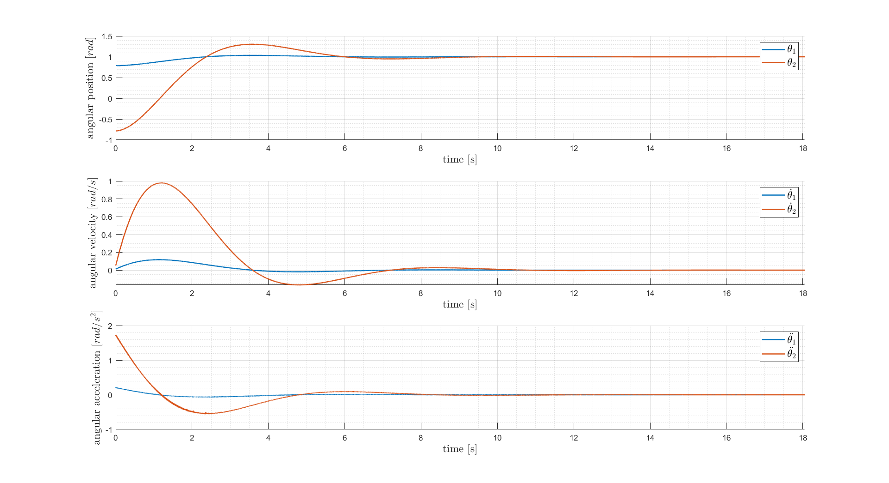

No obstante, lo realmente interesante es observar su comportamiento ante una perturbación externa:

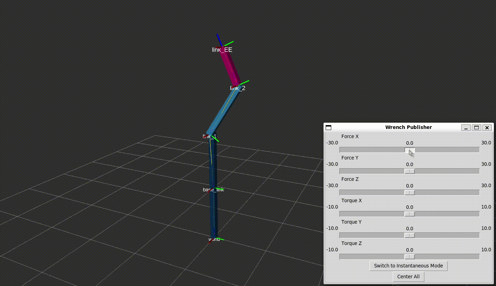

El brazo muestra cierta oposición a la fuerza ejecutada en el efector final, volviendo a la posición deseada tras dejar de aplicar esta fuerza. El manipulador no se inestabiliza ante la presencia de perturbaciones externas, cumpliendo así el objetivo previamente propuesto.

---

## Conclusiones:

En esta práctica se ha implementado un controlador de dinámica inversa para un manipulador de dos grados de libertad. Se ha comprobado que la compensación de gravedad permite anular el efecto del peso del robot, mientras que la cancelación dinámica completa compensa además los efectos de inercia, Coriolis y fricción.

Asimismo, se ha añadido un controlador PD para garantizar la estabilidad del sistema y mejorar el seguimiento de la referencia. Adicionalmente, se ha observado que el rendimiento del controlador depende de la precisión del modelo dinámico utilizado, ya que errores en los parámetros provocan desviaciones respecto al comportamiento ideal.
